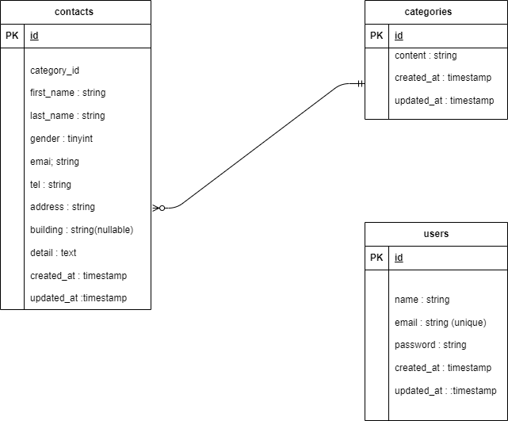

## アプリケーション名

お問い合わせフォーム

## 環境構築

・Docker ビルド

```bash
git clone リンク
docker-compose up -d --build
```

\*MySQL は、OS によって起動しない場合があるのでそれぞれの PC に合わせて docker-compsoe.yml ファイルを編集してください。

#### Laravel 環境構築
・composer のインストール

```bash
docker-compose exec php bash
composer install
```

#### 日本語ファイルの導入
このプロジェクトではLaravelのバリデーションメッセージ等を日本語化するために [laravel-lang/lang](https://github.com/Laravel-Lang/lang) を使用しています。

#### セットアップ手順:

```bash
composer require laravel-lang/lang:~7.0 --dev
cp -r ./vendor/laravel-lang/lang/src/ja ./resources/lang/
```
Laravelの設定ファイル config/app.php の以下の項目が ja になっていることを確認してください。

```php
'local' => 'ja',
```

##### .env.example をコピーし.env ファイルを作成、環境変数の変更。

##### アプリケーションキーの設定

```bash
php artisan key:generate

```

##### マイグレーション、シーディングの実行

```bash
php artisan migrate
php artisan db:seed

```

##　使用技術

フレームワーク：Laravel 8.7<br>
言語：PHP 7.4.9<br>
データベース：MySQL 8.0<br>
Web サーバー：Nginx 1.21.1<br>
管理ツール：phpMyAdmin<br>
実行環境：Docker（docker-compose v3.8）<br>

## ER 図



## URL

・環境構築 : http://localhost/<br>
・phpMyAdmin : http://localhost:8080/

